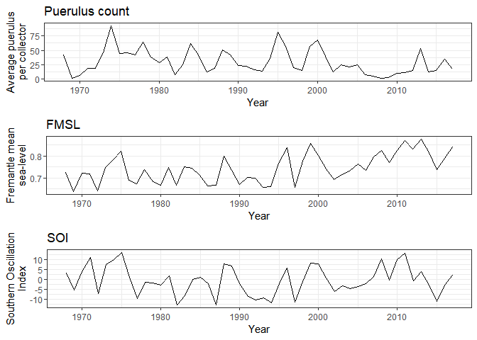
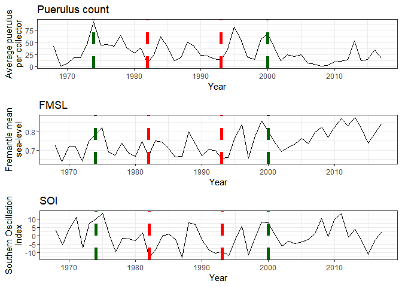

Oceanographic drivers of Western Rock Lobster puerulus settlement
================
Tim Langlois and Matt Navarro
14/04/2020

In this exercise we are going to explore how oceanography drives
recruitment of Western Rock Lobster.

Before we being lets load the packages we will use today.

``` r
library(readr) # to read data from GitHub
library(ggplot2) #to plot data
library(cowplot) #to create multiplots
```

    ## 
    ## ********************************************************

    ## Note: As of version 1.0.0, cowplot does not change the

    ##   default ggplot2 theme anymore. To recover the previous

    ##   behavior, execute:
    ##   theme_set(theme_cowplot())

    ## ********************************************************

``` r
library(tidyr) #to tidy data
```

    ## 
    ## Attaching package: 'tidyr'

    ## The following object is masked from 'package:RCurl':
    ## 
    ##     complete

``` r
library(dplyr) #to re-arrange data
```

    ## 
    ## Attaching package: 'dplyr'

    ## The following objects are masked from 'package:stats':
    ## 
    ##     filter, lag

    ## The following objects are masked from 'package:base':
    ## 
    ##     intersect, setdiff, setequal, union

From the lecture you will recall that after spawning, Western Rock
Lobster larvae (called phyllosoma) are carried by currents between 400
and 1,500 km offshore. After a while the larvae metamorphose into
transparent mini lobster known as pueruli. The puerulus then swim back
to the coastline and settle onto shallow reefs.

Today we will be playing with data from puerulus collectors. These
collectors are placed in the ocean at eigth key locations and capture
puerulus as they are swimming back towards the shallow reefs.

</br>


</br>

### Data description

Lets have a quick look at our data.

``` r
dat <- as.data.frame(read_csv(url("https://raw.githubusercontent.com/UWA-SCIE2204-Marine-Systems/Biological-oceanography/master/Data/Data_for_puerulus.csv")))
head(dat)
```

    ##   Year  Puerulus      FMSL       SOI
    ## 1 1968 42.307674 0.7240000  3.016667
    ## 2 1969  0.853321 0.6358571 -5.383333
    ## 3 1970  5.515556 0.7221429  3.925000
    ## 4 1971 18.149459 0.7198571 10.950000
    ## 5 1972 18.468601 0.6390000 -7.350000
    ## 6 1973 45.085088 0.7482857  7.283333

The puerulus column is the average annual number of puerulus captured in
the collectors. This is a reliable indicator of recruitment, and has
been linked strongly to the expected catch in 4 years time.

Given the extended period of time that lobster larvae and pueruli spend
offshore, we would expect that the number of settling puerulus would
depend on the oceanographic conditions in a given year. Across the WA
coastline, the Southern flowing Leeuwin current is the dominating
process. To explore how the Leeuwin current affects puerulus counts we
have two proxies for the Leeuwin current strength:

  - FMSL is the Fremantle mean sea level. As the Leeuwin current pushes
    warm water down the WA coast it actually increases the sea-level off
    Fremantle. In years with a strong Leeuwin current the sea-level is
    higher.
  - SOI is the Southern Oscilattion Index. Technically the SOI is the
    difference in the surface air pressure between Tahiti and Darwin.
    All you need to know is that when the SOI is higher, the Leeuwin
    current is stronger.

### Plot puerulus counts

Make a time series plot of puerulus counts. Note that we are using the
ggplot functions we used in the marine reserves lab. We are also saving
the plot inside R as “puerulus\_plot” as we will use this plot again.

``` r
puerulus_plot<-ggplot(dat, aes(x = Year, y = Puerulus))+ 
  geom_line()+
  ylab("Average puerulus\nper collector")+
  ggtitle("Puerulus count")+
  theme_bw()

puerulus_plot
```

<!-- -->

Notice how the data puerulus counts go up and down. There is actually a
lot of variability.

Q1. Use the summary() function to look at the maximum and minimum
Puerulus counts across the data range. You will need to write your own
code. Use help(summary) for details or google how to do it (google is
always your friend when using R). hint: summary() only requires one
argument. Record the maximum and minimum Puerulus count for the quiz.

Q2. Use the summary() function again to look at the maximum and mimum
for SOI. Record the maximum and minimum SOI for the quiz.

### Create a composite plot

Lets now try and create a composite plot. A composite plot combines
several plots and is an easy way to start to explore relationships in
your data. To do this we are going to make three individual plots using
ggplot, and use the plot\_grid function to plot them simultaneously. We
already have the first plot which is stored as puerulus\_plot. In the
next section of code we create a FMSL plot and a SOI index plot and then
create the multi-plot using plot\_grid.

``` r
fmsl_plot<- ggplot(dat, aes(x = Year, y = FMSL))+ #create the fmsl plot
  geom_line()+
  ylab("Fremantle mean\nsea-level")+
  ggtitle("FMSL")+
  theme_bw()

soi_plot<-ggplot(dat, aes(x = Year, y = SOI))+ #create the soi plot
  geom_line()+
  ylab("Southern Oscillation\nIndex")+
  ggtitle("SOI")+
  theme_bw()

multi_plot<-plot_grid(puerulus_plot, fmsl_plot, soi_plot, ncol = 1) #create the composite plot
multi_plot
```

<!-- -->

Have a close look…can you see anything interesting in the patterns you
see across the 3 variables? ……

…..In general it seems that when fmsl and soi are higher, the puerulus
count is higher. In other words in years with a strong Leeuwin current
more puerulus settle onto shallow reefs.

To make the pattern more obvious we can add some vertical lines to our
plots. We will use green to indicate years with abnormally high puerulus
counts, and red to indicate years with abnormally low puerulus counts.

``` r
multi_plot<-plot_grid(puerulus_plot + 
                      geom_vline(xintercept = c(1974, 2000), color = "darkgreen", linetype="dashed", size = 2) +
                      geom_vline(xintercept = c(1982, 1993), color = "red", linetype="dashed", size = 2),
                      
                      fmsl_plot + 
                      geom_vline(xintercept = c(1974, 2000), color = "darkgreen", linetype="dashed", size = 2)+
                      geom_vline(xintercept = c(1982, 1993), color = "red", linetype="dashed", size = 2),
                      
                      soi_plot + 
                      geom_vline(xintercept = c(1974, 2000), color = "darkgreen", linetype="dashed", size = 2)+
                      geom_vline(xintercept = c(1982, 1993), color = "red", linetype="dashed", size = 2),
                      
                      ncol = 1)
multi_plot
```

<!-- -->

Can you see the pattern now? That is quite interesting right?

You now have some evidence that recruitment for the western rock lobster
is linked to the strength of the Leeuwin current. If you are a manager
of a lobster fishery this might be bad news…you have no ability to
control how strong the Leeuwin current is. This limits your ability to
manage the fishery, and suggests you need to incorporate the strength of
the Leeuwin current into your management decisions.

### Calculate correlation coefficients

Lets dig a little deeper.

The cor function returns the correlation coefficient between two
variables.

``` r
cor(dat$Puerulus, dat$FMSL) #Check FMSL correlation coefficient
```

    ## [1] 0.2260079

Q3. Modify the code above to estimate the correlation coefficient
between Puerulus and SOI. Record your answer for the quiz.

The correlation coefficients are positive between puerulus and FMSL and
puerulus and SOI. This confirms what we obsrerved in the multiplot -
when the FMSL and SOI are higher puerulus counts are higher.

But, the correlation coefficients are not huge. For a high degree of
correlation we would expect something more than 0.5.

So what else might be going on?

\#\#\#Investigating relatively low correlations

To investigate why we are getting relatively low correlation
coefficients lets take another look at our multiplot

``` r
multi_plot
```

<!-- -->

Have a closer look at the relationship in recent years, since 2005.

There seems to be something weird going on…from 2007 until 2014 puerulus
counts were low, but FMSL and SOI were both high.

A good way to visualise how the relatinoship between puerulus counts and
our Leeuwin current proxies has changed since 2007 is to create a colour
coded dot-plot.

To do this we will use the mutate and ifelse to create a new variable in
our data called “pre\_post2007” indicating if the data point is before
or after 2007. This new variable is then used in the color argument in
ggplot so that we see dots in different colours depending on whether
they are before or after 2007.

``` r
dat %>% mutate(pre_post2007 = ifelse(Year >= 2007, "Post 2007", "Pre 2007" )) %>%
ggplot(., aes(x = Puerulus, y = FMSL, color = pre_post2007))+ 
  ylab("Fremantle mean sea-level")+ 
  xlab("Average puerulus per collector")+
  geom_point()+
  theme_bw()
```

<!-- -->

You can see that all of the data points since 2007 are clustered in the
top left-hand-side corner: they have low puerulus counts but high FMSL.

We can also explore correlation coefficients for just the data before
2007

``` r
dat_pre2007<-dat %>% subset(Year < 2007) #subset data to pre 2007

cor(dat_pre2007$Puerulus, dat_pre2007$FMSL) #Check FMSL correlation coefficient
```

    ## [1] 0.6044675

Q4. Modify the above code to estimate the correlation coefficient pre
2007 between Puerulus and SOI. Record your answer for the quiz.

Q5. True/False: The correlation coefficient between Puerulus count and
SOI is larger when using all of the data compared to just using the pre
2007 data?

### What has changed?

So why has the relationship between the Leeuwin current strength and
puerulus counts broken down in recent years?

The truth is that nobody knows, but people are looking into it. We have
a PhD student here at UWA who is working with Department of Fiseries to
find an explanation\!

Take a look at - <https://marineecology.io//phd-students/jess-kolbusz/>
